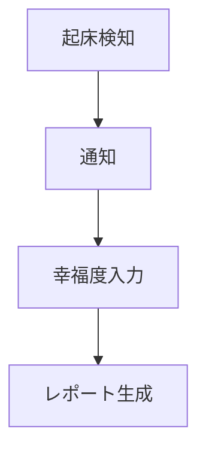

# CLAUDE.md（プロジェクトメモリ）

## 概要

本リポジトリは iOS アプリ「**きづき**」専用のリポジトリです。
開発を進めるうえで遵守すべき標準ルールを定義します。

## プロダクトの設計原則（最重要）

以下はコード・文言・機能すべてに適用される絶対原則です。**実装の判断に迷ったらここに戻ること。**

| 原則           | 意味                                       |
| -------------- | ------------------------------------------ |
| **急かさない** | ユーザーを促す表現・機能を実装しない       |
| **責めない**   | 他人や理想値ではなく、過去の本人と比較する |
| **絞る**       | 指標は歩数・睡眠・幸福度の3つのみ          |

### 実装してはならないもの

- 催促・リマインドの通知
- ストリーク（連続記録日数）
- 一般統計・理想値との比較
- 目標歩数の設定と達成の督促

### ユーザー向け文言の禁止表現

勧誘（〜しましょう）、義務（〜すべきです）、目標提示（あと◯歩）、評価（よくできました）、未達の指摘（足りていません）。

**判定の原則**: 主語が「過去のあなたがどうだったか」なら許容。「これからどうすべきか」なら禁止。
詳細は `docs/product-requirements.md` の F-3 を参照。

---

## プロジェクト構造

### ドキュメントの分類

#### 1. 永続的ドキュメント（`docs/`）

アプリケーション全体の「**何を作るか**」「**どう作るか**」を定義する恒久的なドキュメント。
基本設計や方針が変わらない限り更新されません。

| ファイル                      | 内容                                                                                   | 状態                            |
| ----------------------------- | -------------------------------------------------------------------------------------- | ------------------------------- |
| **product-requirements.md**   | プロダクト要求定義書。ビジョン、ターゲットユーザー、機能要件、非機能要件、受け入れ条件 | ✅ 作成済                       |
| **architecture.md**           | 技術仕様書。テクノロジースタック、開発ツール、技術的制約、HealthKit API仕様            | ✅ 作成済                       |
| **glossary.md**               | ユビキタス言語定義。ドメイン用語、英日対応表、コード上の命名規則                       | ✅ 作成済                       |
| **functional-design.md**      | 機能設計書。データモデル、コンポーネント設計、画面遷移図、ワイヤフレーム               | ⬜ **画面実装の直前に作成する** |
| **development-guidelines.md** | 開発ガイドライン。**リポジトリ構成**、ツール設定、コーディング規約、Git規約            | ✅ 作成済                       |

⚠️ **repository-structure.md は作成しない。**リポジトリ構成は `development-guidelines.md` の4章に含める。

#### 2. 作業単位のドキュメント（`.steering/[YYYYMMDD]-[開発タイトル]/`）

特定の開発作業における「**今回何をするか**」を定義する一時的なステアリングファイル。
作業完了後は参照用として保持し、新しい作業では新しいディレクトリを作成します。

| ファイル            | 内容                                                               |
| ------------------- | ------------------------------------------------------------------ |
| **requirements.md** | 今回の作業の要求内容、ユーザーストーリー、受け入れ条件、制約事項   |
| **design.md**       | 実装アプローチ、変更するコンポーネント、データ構造の変更、影響範囲 |
| **tasklist.md**     | 具体的な実装タスク、進捗状況、完了条件                             |

### ステアリングディレクトリの命名規則

```
.steering/[YYYYMMDD]-[開発タイトル]/
```

**例：**

- `.steering/20260808-healthkit-integration/`
- `.steering/20260809-happiness-input/`
- `.steering/20260810-ai-report/`

---

## コンテキストの読み込みルール

⚠️ **必要な時に必要なだけ読み込むこと。**最初から全ドキュメントを読まない。

| 作業内容                               | 読むべきドキュメント             |
| -------------------------------------- | -------------------------------- |
| 進捗確認・次に何をするか               | `WBS.md`                         |
| 仕様の確認・機能の可否判断             | `docs/product-requirements.md`   |
| HealthKit・ライブラリ・技術選定        | `docs/architecture.md`           |
| 命名・用語の統一                       | `docs/glossary.md`               |
| **ファイルをどこに置くか**・コード規約 | `docs/development-guidelines.md` |
| 画面・コンポーネント設計               | `docs/functional-design.md`      |
| 現在の作業の詳細                       | `.steering/[最新]/` 配下         |

**仕様に関する唯一の情報源は `docs/product-requirements.md`。**他のドキュメントやコメントと矛盾した場合は PRD を正とする。

---

## 進捗管理（WBS.md）

⚠️ **`WBS.md` は進捗管理の唯一の情報源。**タスクの状態を他の場所で管理しない。

### 更新義務

| タイミング       | 操作                                                     |
| ---------------- | -------------------------------------------------------- |
| タスクに着手     | 状態を `⬜` → `🔺`                                       |
| タスク完了       | 状態を `🔺` → `✅`、**実績時間を記入**                   |
| 保留・中止       | `⏸` / `❌` にし、備考に理由を記入                        |
| 新タスク発生     | 該当章に行を追加（IDは連番の続き）、サマリの見積も再計算 |
| セッション終了時 | サマリの状態列と「最終更新」日付を更新                   |

### 禁止事項

- ❌ 完了タスクの行を削除する（履歴として残す）
- ❌ 見積時間を実績値に書き換える（実績は別列に記入）
- ❌ **優先度（Must/Should/Could）を確認なく変更する**
- ❌ WBS.md とは別に進捗リストを作る

詳細な運用ルールは `WBS.md` の冒頭に記載。

---

## 開発プロセス

### 機能追加・修正時の手順

#### 1. 影響分析

- `WBS.md` で該当タスクを確認。存在しなければ行を追加する
- 永続的ドキュメント（`docs/`）への影響を確認
- 変更が基本設計に影響する場合は `docs/` を更新

#### 2. ステアリングディレクトリ作成

```bash
mkdir -p .steering/[YYYYMMDD]-[開発タイトル]
```

#### 3. 作業ドキュメント作成

1. `requirements.md` - 要求内容
2. `design.md` - 設計
3. `tasklist.md` - タスクリスト（**WBSのタスクを手順レベルに分解したもの**）

**重要：** 1ファイルごとに作成後、必ず確認・承認を得てから次のファイル作成を行う

#### 4. 永続的ドキュメント更新（必要な場合のみ）

#### 5. 実装開始

`tasklist.md` に基づいて実装を進める。
**着手時に `WBS.md` の該当タスクを `🔺` にする。**

#### 6. 品質チェック

- 型チェック（`tsc --noEmit`）
- Lint
- **ユーザー向け文言に禁止表現が含まれていないか確認**

#### 7. WBS更新

**完了したタスクを `✅` にし、実績時間を記入する。**

---

## ドキュメント管理の原則

### 永続的ドキュメント（`docs/`）

- アプリケーションの基本設計を記述
- 頻繁に更新されない
- 大きな設計変更時のみ更新
- プロジェクト全体の「北極星」として機能

### 作業単位のドキュメント（`.steering/`）

- 特定の作業・変更に特化
- 作業ごとに新しいディレクトリを作成
- 作業完了後は履歴として保持
- 変更の意図と経緯を記録

---

## 図表・ダイアグラムの記載ルール

### 記載場所

設計図やダイアグラムは、関連する永続的ドキュメント内に直接記載します。
独立した diagrams フォルダは作成しません。

- データモデル図、画面遷移図、ワイヤフレーム → `functional-design.md`
- システム構成図 → `architecture.md`

### 記述形式

**Mermaid記法を推奨。**Markdownに直接埋め込め、バージョン管理が容易。



シンプルな図表は ASCII アートでも可。画像が必要な場合のみ `docs/images/` に PNG/SVG で配置。

---

## 技術的な注意事項

### ビルド

⚠️ **`app.json` の plugins を変更したら必ずリビルドすること。**
ビルド後に追加しても実機には反映されず、`NitroModules could not be found` 等のエラーになる。

```bash
eas build --profile development --platform ios
```

### HealthKit

⚠️ **権限リクエストが完了する前にデータ取得を呼ぶとアプリがクラッシュする。**

⚠️ **歩数は必ず `queryStatisticsForQuantity` を使う。**
`queryQuantitySamples` の単純合計は iPhone と Apple Watch の重複で二重計上される。

詳細は `docs/architecture.md` を参照。

### ライブラリのAPI確認

⚠️ **ドキュメントより型定義を優先すること。**
`@kingstinct/react-native-healthkit` は API 名・引数の形がバージョンで変わる。

```
node_modules/@kingstinct/react-native-healthkit/lib/typescript/healthkit.d.ts
```

---

## その他の注意事項

- ドキュメントの作成・更新は段階的に行い、各段階で承認を得る
- 永続的ドキュメントと作業単位のドキュメントを混同しない
- コード変更後は必ず型チェック・Lint を実施する
- 健康データを扱うため、セキュリティに配慮する（APIキーをアプリに埋め込まない、ローカル保存を原則とする）
- 図表は必要最小限に留め、メンテナンスコストを抑える

---

※ ドキュメント構成は『実践Claude Code入門』（西見公宏・吉田真吾・大嶋勇樹, 技術評論社）を参考にしています。
