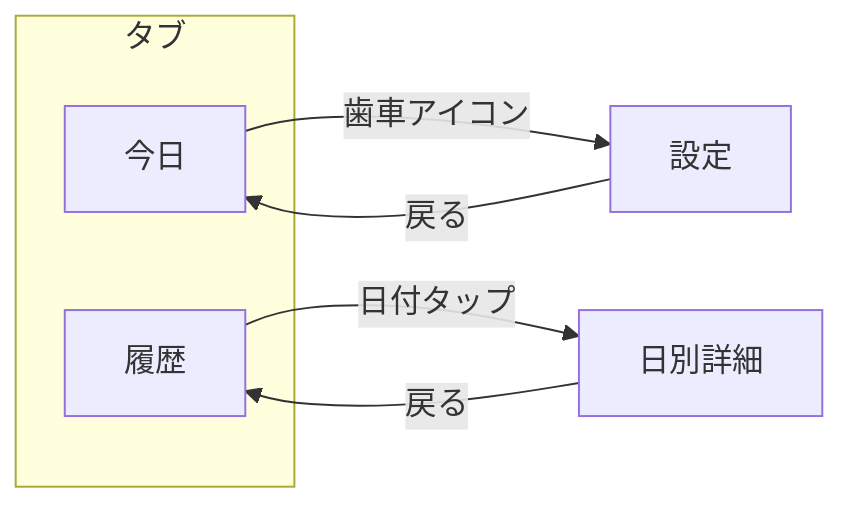
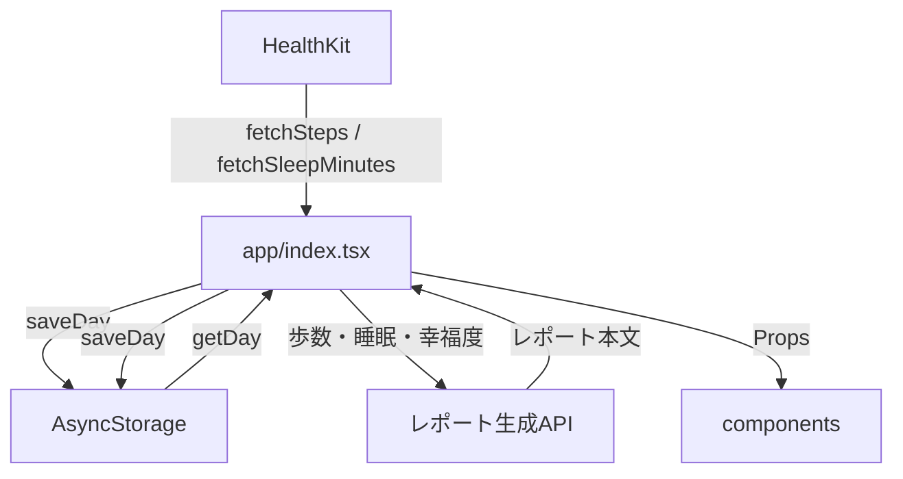

# 機能設計書 — きづき

作成日: 2026-08-10

---

## 1. 画面構成

### ナビゲーション

**下タブ2つ + ヘッダーから設定へ遷移。**



⚠️ **設定にタブを割り当てない。**使用頻度が低いため、今日の画面のヘッダーから遷移する。

### PRDからの変更点

PRDでは画面を「今日・履歴・レポート」としていたが、**レポートは独立画面にしない。**

理由: 朝の動線が「幸福度入力 → レポート生成 → 表示」と一本化されたため、
レポートは今日の画面の中に表示するほうが自然。過去のレポートは履歴から辿る。

### ファイル構成

```
app/
├── _layout.tsx          # タブナビゲーション定義
├── index.tsx            # 今日
├── history.tsx          # 履歴
├── settings.tsx         # 設定
└── day/[date].tsx       # 日別詳細（履歴から遷移）
```

---

## 2. 今日の画面（`app/index.tsx`）

### 状態の分岐

| #   | 状態                                 | 表示内容                          |
| --- | ------------------------------------ | --------------------------------- |
| A   | 権限未許可                           | 権限リクエストの案内              |
| B   | 幸福度が未入力（入力可能時間帯）     | 歩数・睡眠 + 幸福度入力           |
| C   | 幸福度が未入力（入力可能時間帯の前） | 歩数・睡眠のみ                    |
| D   | 幸福度入力済み・レポート生成中       | 歩数・睡眠 + 生成中の表示         |
| E   | 幸福度入力済み・レポート表示         | 歩数・睡眠 + レポート             |
| F   | 生成失敗                             | 歩数・睡眠 + エラーと再試行ボタン |

### レイアウト（状態E）

```
┌─────────────────────────────┐
│  きづき              ⚙️      │  ← ヘッダー
├─────────────────────────────┤
│                             │
│      8,432 歩               │  ← 歩数（最も大きく）
│                             │
│   睡眠 6時間52分             │  ← 睡眠（副次）
│                             │
├─────────────────────────────┤
│                             │
│  昨夜は、いつもより30分       │  ← レポート
│  長く眠れていました。         │
│  ...                        │
│                             │
└─────────────────────────────┘
```

⚠️ **歩数を最も大きく表示する。**主役は運動であり、睡眠・幸福度はその成果（PRD 1章）。

### 幸福度入力（状態B）

```
┌─────────────────────────────┐
│  今日はどんな一日でしたか      │
│                             │
│   😞   😕   😐   🙂   😊     │
│                             │
└─────────────────────────────┘
```

- 質問文は対象日で出し分ける（今日 / 昨日 / ◯月◯日）
- **数値を表示しない**（採点の印象を与えるため。glossary 4章）
- タップで即保存 → レポート生成へ

### 表示の判定ロジック

```
権限あり？
├─ No → 状態A
└─ Yes
   ├─ 前日分が未入力？ → 状態B（質問文「昨日は〜」）
   └─ 前日分は入力済み
      ├─ 当日分が未入力 かつ 入力可能時間帯 → 状態B（質問文「今日は〜」）
      ├─ 当日分が未入力 かつ 時間帯前 → 状態C
      └─ 入力済み
         ├─ レポート未生成 → 生成開始 → 状態D
         ├─ 生成成功 → 状態E
         └─ 生成失敗 → 状態F
```

⚠️ **前日分の未入力を優先する。**朝に開いたとき、まず昨日を振り返ってもらう（PRD F-2-4）。

---

## 3. 履歴画面（`app/history.tsx`）

### レイアウト

```
┌─────────────────────────────┐
│  履歴                        │
├─────────────────────────────┤
│  [グラフ: 歩数と睡眠]         │  ← Should
├─────────────────────────────┤
│  8/10 (日)  8,432歩  6h52m 🙂│  ← タップで詳細へ
│  8/9  (土)  3,120歩  7h10m 😊│
│  8/8  (金)  9,801歩  5h30m 😐│
│  8/7  (木)  ―        ―     ―│  ← データなし
│  ...                        │
└─────────────────────────────┘
```

- 直近30日分を表示
- 幸福度が未入力の日は絵文字なし → **タップで後追い入力**（PRD F-2-5）
- データがない日も行として表示する（欠損を隠さない）

⚠️ **未入力の日を強調しない。**「入力してください」等の督促表示を出さない。

---

## 4. 日別詳細（`app/day/[date].tsx`）

履歴から日付をタップして遷移。

```
┌─────────────────────────────┐
│  ← 8月9日（土）              │
├─────────────────────────────┤
│      3,120 歩               │
│   睡眠 7時間10分             │
├─────────────────────────────┤
│  幸福度: 😊                  │  ← 未入力ならここで入力
├─────────────────────────────┤
│  その日のレポート             │
│  ...                        │
└─────────────────────────────┘
```

---

## 5. 設定画面（`app/settings.tsx`）

```
┌─────────────────────────────┐
│  ← 設定                      │
├─────────────────────────────┤
│  就寝予定時刻        23:00 > │
│  通知                  [ON] │
├─────────────────────────────┤
│  このアプリについて        > │
└─────────────────────────────┘
```

⚠️ **設定項目を増やさない。**比較基準や目標値など、体験に関わる設定は持たない（PRD F-6）。

「このアプリについて」に医療機器ではない旨の注意書きを置く（NFR-2-3）。

---

## 6. コンポーネント設計

### 一覧

| コンポーネント        | 配置              | 責務                         |
| --------------------- | ----------------- | ---------------------------- |
| `StepsDisplay`        | `src/components/` | 歩数の大きな表示             |
| `SleepDisplay`        | `src/components/` | 睡眠時間の表示               |
| `HappinessInput`      | `src/components/` | 5段階の絵文字入力            |
| `ReportView`          | `src/components/` | レポート本文の表示           |
| `GeneratingIndicator` | `src/components/` | 生成中の処理表示             |
| `DayListItem`         | `src/components/` | 履歴の1行                    |
| `TrendChart`          | `src/components/` | 歩数と睡眠の折れ線（Should） |

### 原則

⚠️ **コンポーネントの中でデータ取得をしない。**Props で受け取る（development-guidelines 4章）。

```tsx
// ✅ 正しい
type Props = { steps: number | null };
export const StepsDisplay = ({ steps }: Props) => ...

// ❌ 誤り
export const StepsDisplay = () => {
  const [steps, setSteps] = useState(null);
  useEffect(() => { fetchSteps(...) }, []);  // ← 画面側の責務
}
```

---

## 7. データフロー



### 画面が持つ責務

- HealthKit とストレージからのデータ取得
- 状態（A〜F）の判定
- レポート生成の呼び出し
- コンポーネントへの Props 受け渡し

### 画面が持たない責務

- 発見の判定 → `src/logic/discovery.ts`
- 入力可能時間帯の判定 → `src/logic/inputWindow.ts`
- 平均・偏差の計算 → `src/logic/statistics.ts`

---

## 8. 実装順序

| #   | 内容                                | 理由                                                             |
| --- | ----------------------------------- | ---------------------------------------------------------------- |
| 1   | `_layout.tsx` タブ構成              | 器を先に作る                                                     |
| 2   | `index.tsx` 骨組み + 歩数・睡眠表示 | 既存の取得処理を繋ぐだけ                                         |
| 3   | `HappinessInput` + 保存             | ストレージ層は完成済み                                           |
| 4   | `inputWindow.ts` + 状態判定         | 入力時間帯の制御                                                 |
| 5   | `history.tsx` 一覧                  | `getDays` を使う                                                 |
| 6   | `day/[date].tsx` 詳細 + 後追い入力  | —                                                                |
| 7   | `settings.tsx`                      | 就寝予定時刻がないと4が動かないため、実際は4の前に暫定値で進める |
| 8   | グラフ（Should）                    | 最後                                                             |

💡 **7を先に作らず、`DEFAULT_BEDTIME = 23:00` の定数で進める。**設定画面は後から差し込める。
